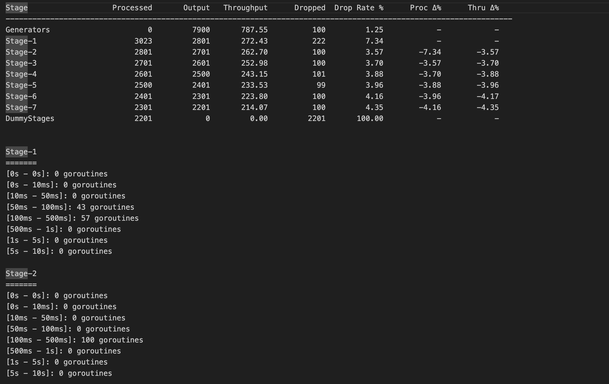

# GoFlow

[](https://golang.org)
[](https://goreportcard.com/report/github.com/AlexsanderHamir/GoFlow)
[](https://opensource.org/licenses/MIT)
[](https://godoc.org/github.com/AlexsanderHamir/GoFlow)


GoFlow is a pipeline visualizer that helps developers fine-tune their concurrent systems by providing statistics for each stage of the pipeline, making it easy to identify bottlenecks and performance issues.



## Table of Contents

- [Features](#features)
- [Installation](#installation)
- [Quick Start Example](#quick-start-example)
- [Stats Explanation](#stats-explanation)
- [Design Explanation](#design-explanation)

## Features

- Visualize pipeline performance stats for each stage.
- Configure each stage independently (buffer size, goroutine count, input rate, etc.).
- Plug in your own main worker functions for accurate stats collection.

## Installation

```sh
go get github.com/AlexsanderHamir/GoFlow
```

## Quick Start Example

Below is a minimal example to give you a basic idea of how to use the library, if you want a more robust example go to: [example.go](code_example/example.go)

```go
package main

import (
	"log"
	"math/rand"
	"time"

	"github.com/AlexsanderHamir/GoFlow/pkg/simulator"
)

func main() {
	sim := simulator.NewSimulator()
	sim.Duration = 10 * time.Second // Or use sim.MaxGeneratedItems = 10000

	generatorConfig := &simulator.StageConfig{
		InputRate:   100 * time.Millisecond,
		RoutineNum:  100,
		BufferSize:  5000,
		IsGenerator: true,
		ItemGenerator: func() any {
			return rand.Intn(100)
		},
	}

	globalConfig := &simulator.StageConfig{
		RoutineNum: 100,
		BufferSize: 5000,
	}

	newStage := func(name string, sleep time.Duration) *simulator.Stage {
		stage := simulator.NewStage(name, globalConfig)
		stage.Config.WorkerFunc = func(item any) (any, error) {
			time.Sleep(sleep)
			return item.(int) + rand.Intn(100), nil
		}
		return stage
	}

	sim.AddStage(simulator.NewStage("Generator", generatorConfig)) // Generator must be first
	sim.AddStage(newStage("Stage-1", 10*time.Millisecond))
	sim.AddStage(newStage("Stage-2", 100*time.Millisecond))
	sim.AddStage(newStage("DummyStage", 200*time.Millisecond)) // DummyStage must be last

	if err := sim.Start(); err != nil {
		log.Fatalf("Failed to start simulator: %v", err)
	}
}
```

## Stats Explanation

- **Processed**: Number of processed but not yet sent items.
- **Output**: Number of items sent to the next stage successfully.
- **Throughput**: Number of output items divided by the duration of the stage in the simulation.
- **Dropped**: Number of items dropped during cancelation when the simulation ends.
- **Drop Rate**: Self explanatory
- **Proc Δ%**: Percentage difference in processed items in comparison with the stage before the current one.
- **Thru Δ%**: Percentage difference in throughput in comparison with the stage before the current one.

## Design Explanation

- **Simulator**: Orchestrates the pipeline and manages stages.
- **Stage**: Represents a processing step. Each stage can have its own configuration and worker function.
- **Generator**: The first stage, responsible for generating items into the pipeline. **(required)**
- **DummyStage**: The last stage, responsible for consuming items and removing them from the pipeline. **(required)**
- **StageConfig**: Configuration for each stage (buffer size, worker count, etc.).
