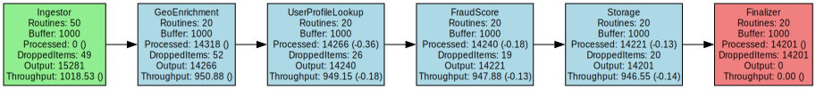
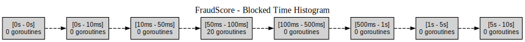

# GoFlow


[](https://golang.org)
[](https://goreportcard.com/report/github.com/AlexsanderHamir/GoFlow)
[](https://coveralls.io/github/AlexsanderHamir/GenPool?branch=main)
[](https://opensource.org/licenses/MIT)
[](https://godoc.org/github.com/AlexsanderHamir/GoFlow/pkg/simulator)


**GoFlow** is a tool for visualizing and tuning the performance of your concurrent systems. It lets you easily experiment with buffer sizes, goroutine counts, and stage depth to find the optimal configuration.

- _Snapshot of the pipeline statistics:_
  

- _Visual representation of the pipeline stages from DOT files:_
  

- _Visual representation of total blocked time per goroutine for each pipeline stage (from DOT files):_
  

## Table of Contents

- [Features](#features)
- [Installation](#installation)
- [Usage Example](#usage-example)
- [Stats Explanation](#stats-explanation)
- [Output Options](#output-options)
- [Contributions](#contributions)
- [Why GoFlow Was Created?](#why-goflow-was-created)

## Features

- Simulate realistic workloads flowing through your concurrent system.
- Visualize the performance of each stage to identify bottlenecks and optimize throughput.
- Configure each stage independently to improve the results.

## Installation

```sh
go get github.com/AlexsanderHamir/GoFlow@v1.0.7
```

## Usage Example

For a detailed example, see [example.go](code_example/example.go).

### Information

1. The first stage acts as the **generator**, feeding data into the pipeline. Configure it accordingly.
2. The last stage acts as the **sink**, consuming and discarding data.
3. Multiple stages can share the same configuration.
4. When starting the simulation, you must specify one of the available output modes using the `DataPresentationChoices` option.

## Stats Explanation

- **Processed**: Number of processed but not yet sent items.
- **Output**: Number of items sent to the next stage successfully.
- **Throughput**: Number of output items divided by the duration of the stage in the simulation.
- **Dropped**: Number of items dropped during cancelation when the simulation ends.
- **Δ%**: Percentage difference in comparison with the stage before the current one.
- **Goroutines**: The total amount of time the spent blocked per goroutine, represented by a histogram.

## Output Options

The library supports different output formats controlled via `DataPresentationChoices`. Below are the available modes:

### 1. **PrintToConsole**

Statistics will be printed directly to the terminal in a human-readable format.

To save the output to a file, you can redirect it using standard shell syntax:

```bash
go run main.go > output.txt
```

### 2. **DotFiles**

When this mode is selected, the library will generate Graphviz DOT files representing the pipeline and its runtime behavior:

1. **Pipeline Overview**
   A single `.dot` file showing the full pipeline layout, including stage names, configuration, and performance stats.

2. **Per-Stage Histograms**
   One `.dot` file per stage visualizing the **goroutine blocked time histogram**, which helps identify stages experiencing contention or delay.

> These `.dot` files can be rendered with tools like Graphviz to generate visual diagrams:
>
> ```bash
> dot -Tsvg pipeline.dot -o pipeline.svg
> ```

## Contributions

We welcome contributions! Before you start contributing, please ensure you have:

- **Go 1.24.3 or later** installed
- **Git** for version control
- Basic understanding of Go testing and benchmarking

### Quick Setup

```bash
# Fork and clone the repository
git clone https://github.com/AlexsanderHamir/GoFlow.git
cd GoFlow

# Run tests to verify setup
 go test -v ./test

# Check for linter errors
 go install github.com/golangci/golangci-lint/cmd/golangci-lint@latest
 golangci-lint run
```

### Development Guidelines

- Write tests for new functionality
- Update documentation for user-facing changes
- Ensure all medium / high priority tests pass before submitting PRs
- Ensure there are no linter errors

## Why GoFlow Was Created?

I was building a query engine where each query plan was turned into a pipeline of stages created at runtime. Each stage processed batches of data, and performance depended on the buffer sizes and number of goroutines per stage.

I built GoFlow to experiment with these settings and easily visualize how they affect throughput and performance, in a way that other tools didn't allow me to do, to the same granularity.
